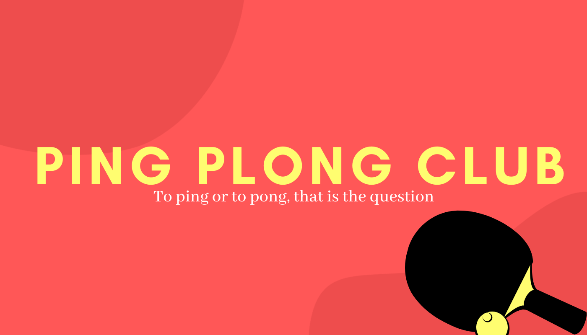
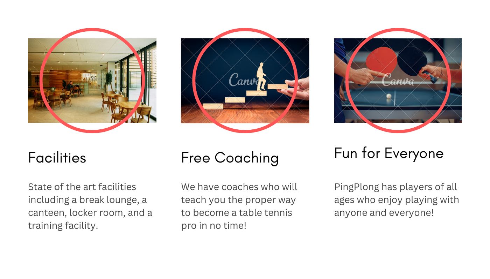
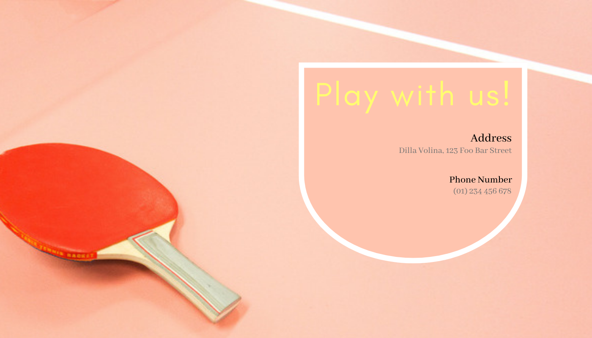

# Web Design Theories
Day 65 is more on the theories on what makes a good web design stand out. This is more on the front-end without creating code.

## Objective
To be able to apply the theories used for web design suchs as color, typography, layout, user interface and experience, among other things, to create a mockup of a simple website.

## Result

